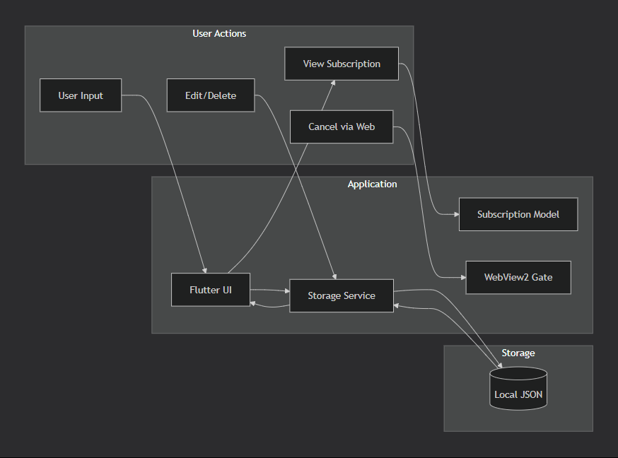
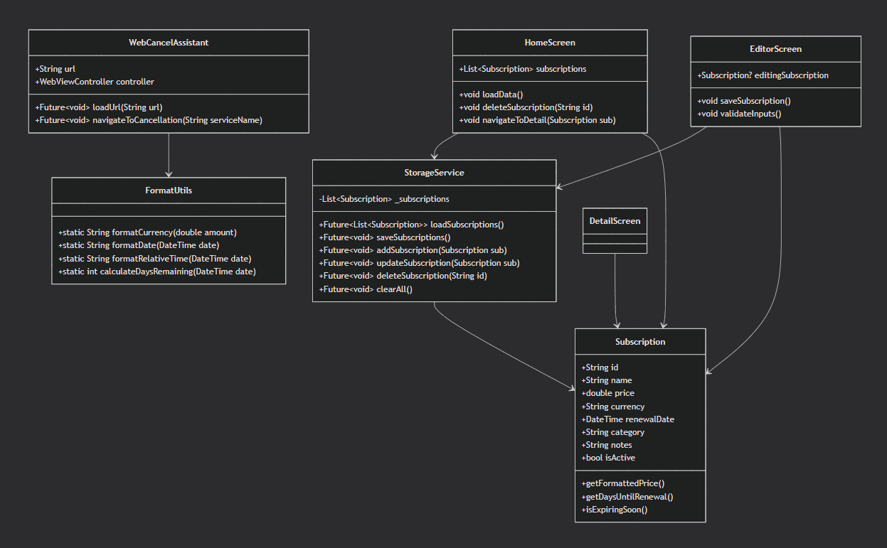
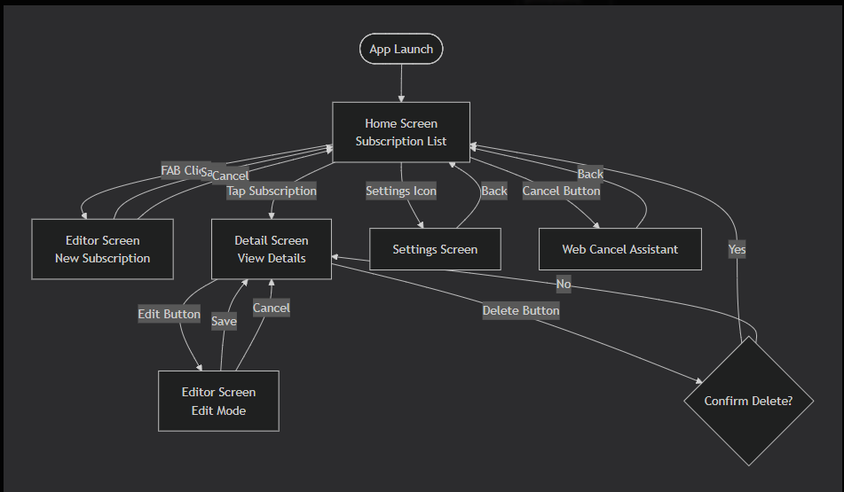
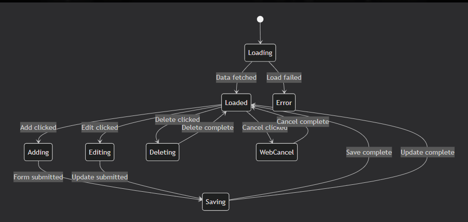
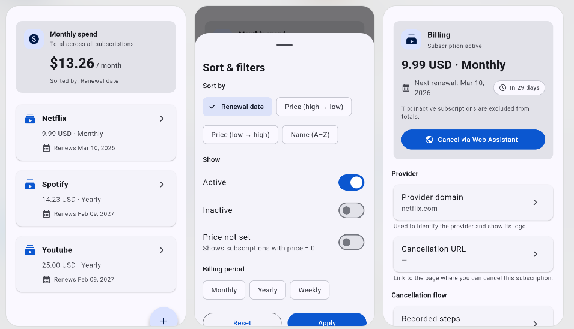

# 🚀 Subscription Reaper

> **Take control of your subscriptions. Stop wasting money effortlessly.**


---


## 🎯 Hero Section

**Subscription Reaper** is a smart desktop app that helps you track, manage, and cancel recurring subscriptions — before they drain your wallet.

💡 *Never forget a subscription again.*

### Why Subscription Reaper?

| Before | After |
|--------|-------|
| ❌ Forgotten renewal dates | ✅ Smart reminders |
| ❌ Wasted money on unused services | ✅ Full visibility |
| ❌ Manual spreadsheet tracking | ✅ One-click management |
| ❌ Difficult cancellation process | ✅ Web Cancel Assistant |

---

## 🧩 Project Overview & Problem Statement

### ❗ The Problem

Modern users subscribe to dozens of services (Netflix, Spotify, Amazon Prime, SaaS tools, free trials), but face common challenges:

| Problem | Impact |
|---------|--------|
| **Forgotten renewal dates** | Unexpected charges on credit cards |
| **Unused subscriptions** | Average user wastes $348/year |
| **Difficult cancellation** | Hidden buttons, endless phone calls |
| **No centralized view** | Logging into 10+ accounts to check |
| **Trial conversion traps** | Forgetting to cancel before billing starts |

### 📊 The Cost of Subscription Neglect
Average user subscriptions: 12-16 active services
Monthly cost: $150-300
Annual wasted spend: $348 (unused services)
Time spent managing: 3+ hours/month


### ✅ The Solution

**Subscription Reaper** centralizes and simplifies subscription management by providing:

- 🏦 **One dashboard** for all subscriptions
- ⏰ **Proactive alerts** before renewal dates
- 🗑️ **Easy deletion** of unwanted services
- 🌐 **Web Cancel Assistant** - helps navigate to cancellation pages
- 💾 **Local-first** - your data stays on your machine

---

## ✨ Key Features

### Core Features

| Feature | Description | Status |
|---------|-------------|--------|
| 📊 **Subscription Tracking** | Manage all subscriptions in one place | ✅ Complete |
| ⏰ **Renewal Alerts** | Never miss billing cycles | ✅ Complete |
| ✏️ **Edit & Organize** | Full CRUD operations for subscriptions | ✅ Complete |
| 🌐 **Web Cancel Assistant** | Helps navigate cancellation pages | ✅ Complete |
| 💾 **Local Storage** | Fast, offline-first experience | ✅ Complete |
| 🖥️ **Windows Desktop UI** | Clean and responsive design | ✅ Complete |
| 📈 **Spending Analytics** | Visualize monthly/yearly costs | 🚧 In Progress |
| 🔔 **Push Notifications** | Desktop alerts for renewals | 📋 Planned |

### Advanced Features

- 🏷️ **Category Organization** – Group by type (Entertainment, Productivity, etc.)
- 💰 **Currency Support** – Multi-currency tracking
- 📅 **Calendar View** – Visual renewal timeline
- 📤 **Export Data** – CSV/JSON backup
- 🔍 **Search & Filter** – Find subscriptions quickly
- 📊 **Spending Trends** – Monthly/yearly comparisons

---

## 🛠️ Tech Stack

### Frontend

| Technology | Purpose | Why Chosen |
|------------|---------|-------------|
| **Flutter (Dart)** | Cross-platform UI framework | Fast iteration, beautiful UI |
| **Material Design 3** | UI components & theming | Modern Windows-native look |
| **Provider/Riverpod** | State management | Simple, reactive architecture |

### Backend

| Technology | Purpose |
|------------|---------|
| ❌ **None** | Local-first architecture – no cloud dependencies |

### Database & Storage

| Technology | Purpose |
|------------|---------|
| **SharedPreferences / Hive** | Local storage for subscription data |
| **JSON serialization** | Data persistence format |

### Utilities

| File | Purpose |
|------|---------|
| `format.dart` | Date, currency, and text formatting |
| `webview2_gate.dart` | WebView2 integration for cancellation assistant |

### Development Tools

| Tool | Purpose |
|------|---------|
| **Flutter SDK 3.x** | Core framework |
| **Dart SDK 3.x** | Programming language |
| **Visual Studio 2022** | Windows desktop build tools |
| **Git** | Version control |

---

## 🏗️ Architecture & Data Flow

### Data Flow Diagram


## UML Class Diagram


## Screen Navigation Flow


## State Management Flow 


## UI Mockups

### 🏛️ High-Level Architecture

```mermaid
graph TB
    subgraph "Presentation Layer"
        HS[Home Screen]
        DS[Detail Screen]
        ES[Editor Screen]
        SS[Settings Screen]
        WC[Web Cancel Assistant]
    end
    
    subgraph "Business Logic Layer"
        SM[Subscription Model]
        VAL[Validation Logic]
        CALC[Calculation Utils]
    end
    
    subgraph "Data Layer"
        SSvc[Storage Service]
        LocalDB[(Local Storage)]
        CFG[Config Storage]
    end
    
    HS --> SSvc
    ES --> SSvc
    DS --> SM
    WC --> WebView2[WebView2 Control]
    SSvc --> LocalDB
    SSvc --> CFG
